# 🛠️ Blooger GitOps: Automated DevSecOps Deployment on Private AKS

Welcome to the **Blooger GitOps** repository. This repository acts as the single source of truth for the deployment configurations of the **Blooger** application on cloud infrastructure. 

Blooger is a modern, 3-tier blog platform featuring a **React (Vite + Nginx) frontend**, a **Node.js Express API backend**, and a **PostgreSQL database**. This repository contains the custom **Helm Charts** used to package and deploy the entire application stack, managed fully under GitOps principles using **ArgoCD** on **Azure Kubernetes Service (AKS)**.


## 🏗️ GitOps & DevSecOps Architecture Flow

```
[ Developer ] ────► Pushes Code to [ Blooger Repo ] (App Source Code)
                                           │
                                           ▼ (GitHub Actions CI/CD Pipeline)
                             ┌────────────────────────────┐
                             │  • Code Security Scan      │
                             │  • Container Vulnerability │
                             │  • Build Docker Images     │
                             │  • Push to Docker Hub      │
                             │  • Auto-Commit Image Tag   │
                             └─────────────┬──────────────┘
                                           │
                                           ▼ (Pushes updated image tag to Helm values)
                                 [ blooger-gitops ] (This Config Repository)
                                           ▲
                                           │ (Pull & Reconcile Loop)
                                      [ ArgoCD ] (Deploy Controller on Cluster)
                                           │
                                           ▼
                                [ Private AKS Cluster ]
                     ┌─────────────────────┼─────────────────────┐
                     ▼                     ▼                     ▼
             [ React Frontend ] ◄───► [ Node.js Backend ] ◄───► [ PostgreSQL ]
             (Port 80 via Nginx)       (Port 8080 API)         (Port 5432 DB)
```


## 📂 Repository Structure

```
blooger-gitops/
├── charts/
│   └── blooger/              # Unified Helm Chart for the 3-tier application
│       ├── templates/        # Kubernetes resource templates (Deployments, Services, Ingress, etc.)
│       │   ├── frontend/     # React frontend delivery resources
│       │   ├── backend/      # Node.js API application resources
│       │   └── database/     # PostgreSQL deployment, volume, and secret manifests
│       ├── Chart.yaml        # Helm chart metadata
│       └── values.yaml       # Configurable deployment variables (Image tags, database credentials, etc.)
├── Progress/                 # Folder containing proof of implementation screenshots
│   ├── 01-testing-app-locally.png
│   ├── 02-deployment-on-kind-cluster.png
│   ├── 03-terraform-infrastructure-provisioning.png
│   ├── 04-access-private-aks-jump-vm.png
│   ├── 05-argocd-application-setup.png
│   ├── 06-argocd-out-of-sync-detection.png
│   ├── 07-argocd-successful-deployment-sync.png
│   └── 08-app-deployed-aks-publicly-accessible.png
├── .gitignore
├── helm-readme.md            # Detailed documentation of Helm chart parameters and configurations
└── README.md                 # Main GitOps repository overview (This file!)
```


## 🛡️ Security Best Practices Implemented
* **Zero Trust Control Plane**: Secure private-only access to the AKS Kubernetes API server via a Jump VM.
* **DevSecOps Ingestion**: Container image and manifest vulnerability scanning in the CI pipeline to block vulnerable builds from reaching the GitOps repo.
* **Secured Configurations**: Database passwords and API secrets are injected securely (utilizing Kubernetes Secrets and ConfigMaps), preventing sensitive credentials from leaking into public Git commits.
* **Isolated Namespaces**: Deployed inside isolated namespaces (`production`/`staging`) on the AKS cluster to guarantee resource limitation and security boundaries.


## 📸 Hands-on Proof of Implementation

To demonstrate a rigorous, production-grade DevOps workflow, the entire deployment pipeline has been validated step-by-step. Below are the sequential stages of the actual hands-on execution, supported by live cluster and environment screenshots.

> 💡 **Note**: The screenshots are stored under the `./Progress/` directory of this repository for self-contained, clean documentation.

### 📦 Phase 1: Local Multi-Stage Containerization & Testing
Before deploying to cloud infrastructure, the 3-tier application components (Frontend, Backend, Database) were containerised using optimized multi-stage Dockerfiles and tested thoroughly in isolated environments.

* **Local Application Testing**: Verified that the frontend successfully communicates with the backend, and that the backend registers all database migrations properly with service discovery.
  
  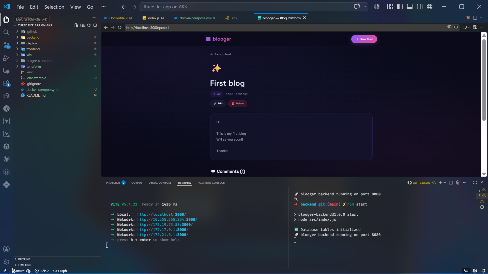

* **Kubernetes Local Validation (kind)**: Deployed the raw application manifests and templated Helm charts on a local `kind` (Kubernetes in Docker) cluster to guarantee template correctness and resource compatibility before deploying to cloud infrastructure.
  
  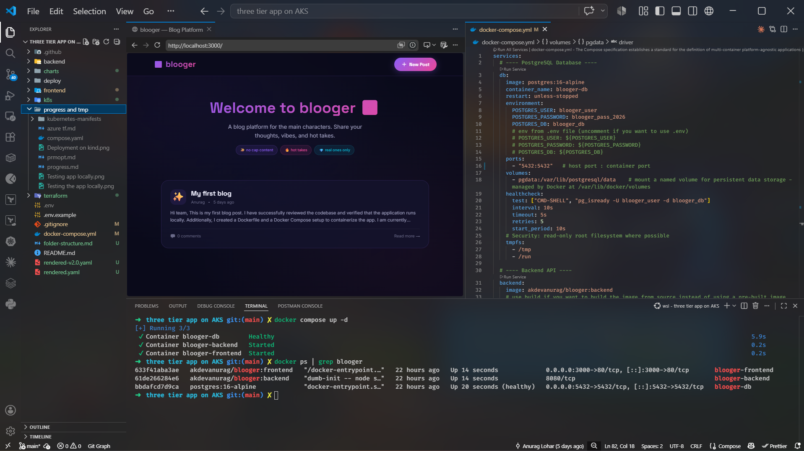
  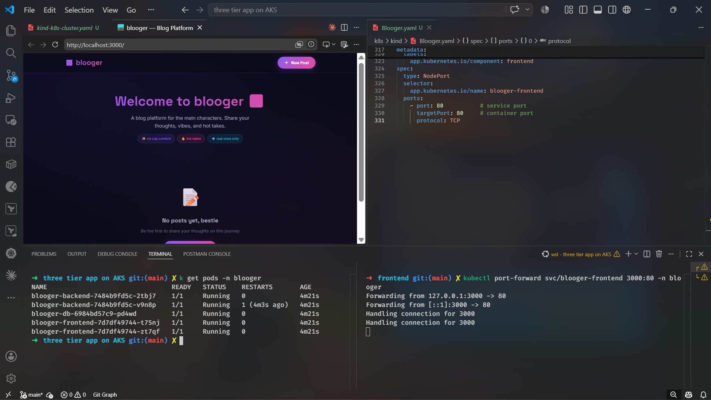
  
---

### ☁️ Phase 2: Infrastructure as Code (IaC) & Secure Cloud Networking
Using **Terraform**, we provisioned the cloud landing zone with an absolute **Zero-Trust** security architecture.

* **Terraform Infrastructure Provisioning**: Executed IaC configurations to dynamically build virtual networks (VNets), subnets, and security boundaries on Microsoft Azure, initializing the Private AKS cluster state.
  
  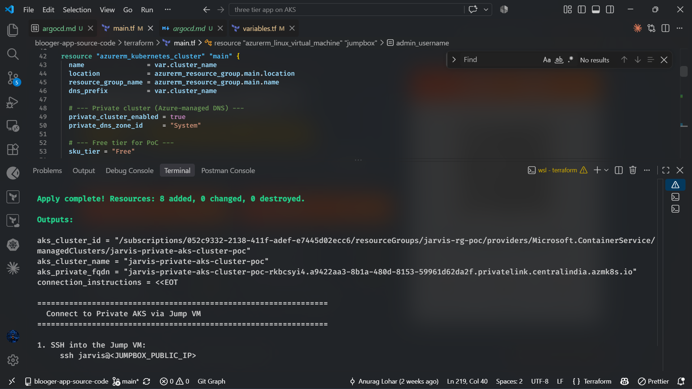

* **Private AKS & Jump VM Architecture**: Since the AKS control plane is kept entirely private (inaccessible from the public internet), cluster administration is securely routed via a bastion host / **Jump VM**. Below shows terminal proof of establishing a secure session on the Jump VM to manage the Private AKS cluster resources via `kubectl`.
  
  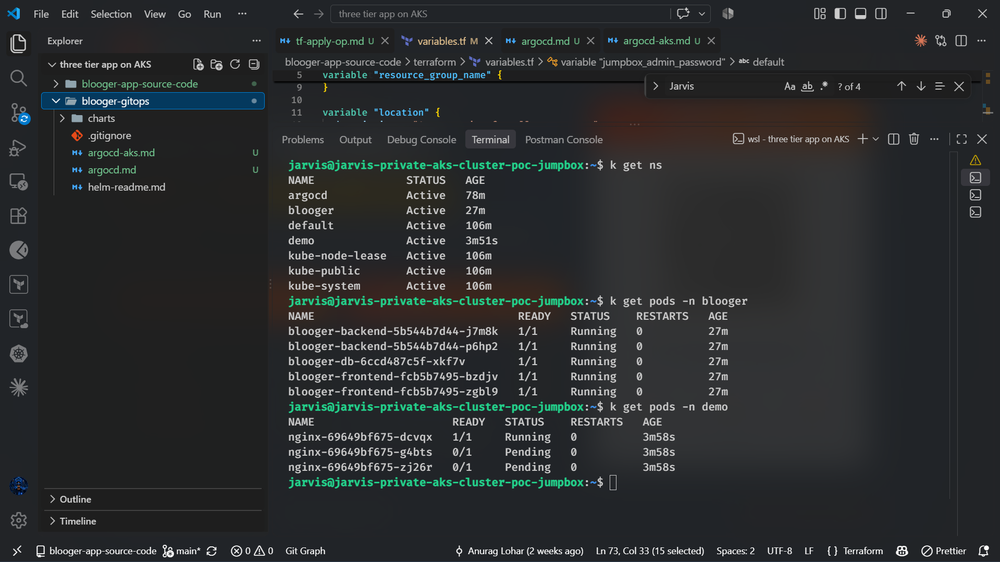

---

### 🛡️ Phase 3: Continuous Integration & DevSecOps Pipeline (GitHub Actions)
Hosted in the primary application repository, the continuous integration pipeline validates and automates our delivery loop. 

* **Automated Security Guardrails**: Code push triggers a security check (including static checks, secrets detection to avoid leakage, and container vulnerability audits via **Trivy**).
* **Continuous Delivery Trigger**: The CI pipeline performs linting, static code analysis, and deep container vulnerability audits using Trivy. Once validated, it builds and pushes lightweight production-grade images to GitHub Container Registry (GHCR). Instead of committing directly to the main branch, the pipeline automatically triggers a Pull Request (PR) against this blooger-gitops repository to propose the image tag updates within (`charts/blooger/values.yaml`)

*(Recommended Pipeline Screenshots)*
* **CI Workflow Pipeline Run**: 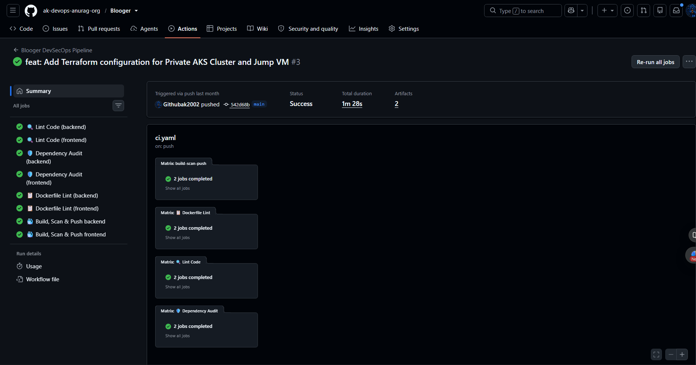 
* **Container Scanning Report**: 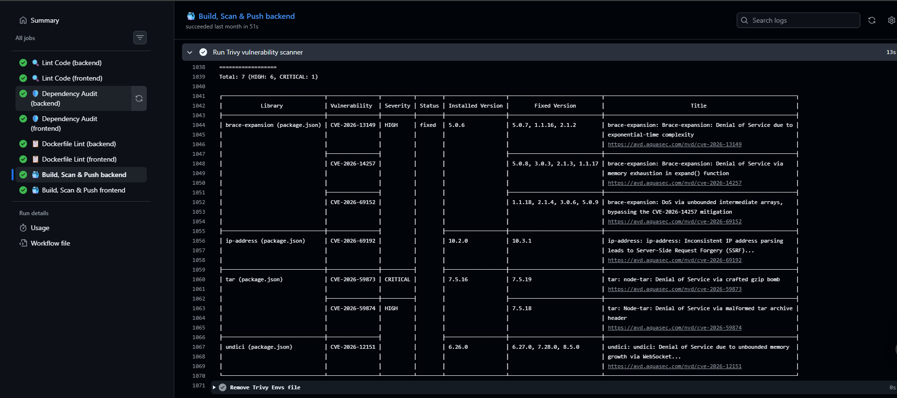 
* **11-automated-image-tag-update-pr.png** 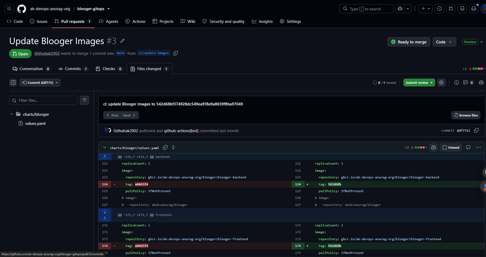

---

### 🔄 Phase 4: Continuous Delivery via GitOps (ArgoCD)
ArgoCD acts as our Kubernetes deployment controller, continuously reconciling cluster states in real-time.

* **Application Ingest**: ArgoCD establishes tracking over this GitOps repository, watching the `/charts/blooger` folder for changes.
  
  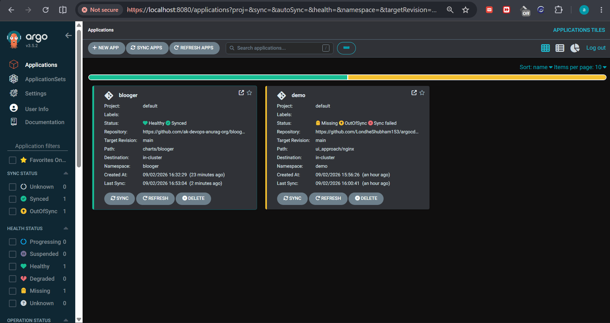

* **Out-of-Sync Detection**: The moment the CI pipeline commits a new Docker image tag to this repo, ArgoCD immediately flags the cluster as out-of-sync, comparing the desired Git state to the live cluster state.
  
  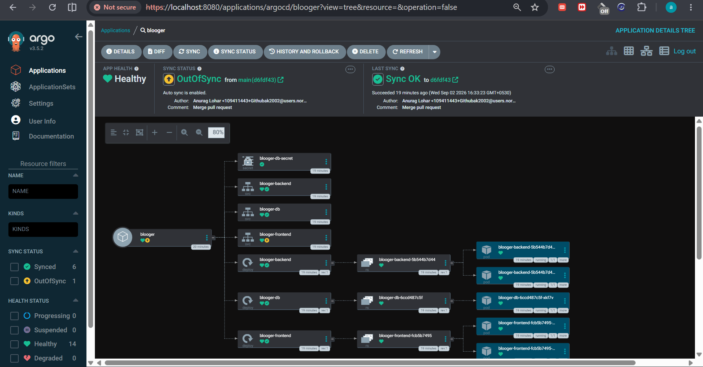

* **Rolling Sync & Self-Healing**: ArgoCD triggers a rolling deployment, pulling the new images and applying updates with zero downtime. Below is the active visual proof of the fully synchronized 3-tier application resources running healthy on the Private AKS cluster.
  
  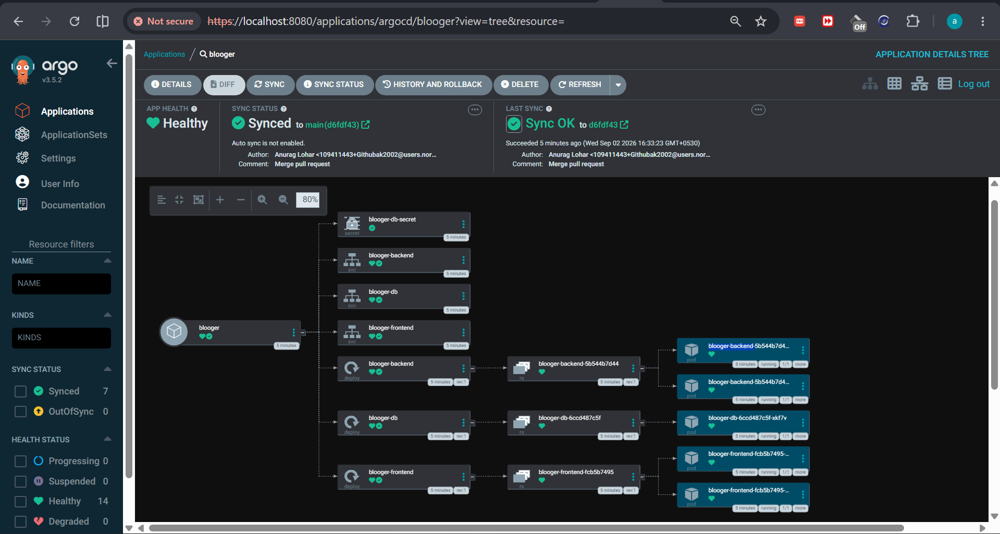

---

### 🌐 Phase 5: Verification & End-to-End Production Access
* **Production Reachability**: The ultimate proof of implementation. The Blooger 3-tier application running live on Azure Kubernetes Service, fully synchronized, and rendering beautifully through public ingress endpoints.
  
  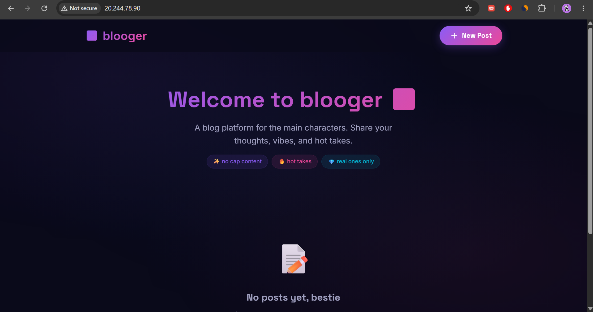

---

*Developed with best practices in DevSecOps and GitOps to deliver high availability, security, and fully-automated, trace-verified deployments. No cap, this platform hits different.* 🛤️
